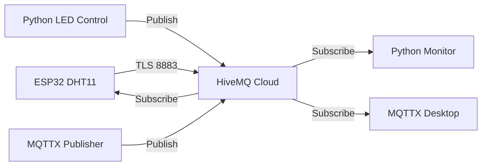

# 🌐 Panduan Setup HiveMQ Cloud untuk DHT11 System

## 📋 Daftar Isi
1. [Setup HiveMQ Cloud Account](#setup-hivemq-cloud-account)
2. [Konfigurasi ESP32](#konfigurasi-esp32)
3. [Konfigurasi Python Scripts](#konfigurasi-python-scripts)
4. [Setup MQTTX untuk HiveMQ Cloud](#setup-mqttx-untuk-hivemq-cloud)
5. [Testing dan Troubleshooting](#testing-dan-troubleshooting)

---

## 🚀 Setup HiveMQ Cloud Account

### Langkah 1: Buat HiveMQ Cloud Account
1. **Buka** [HiveMQ Cloud Console](https://console.hivemq.cloud)
2. **Klik** "Sign Up" untuk membuat account baru
3. **Verifikasi** email Anda
4. **Login** ke HiveMQ Cloud Console

### Langkah 2: Buat Cluster Baru
1. **Dashboard** → Klik "Create New Cluster"
2. **Pilih Plan:**
   - **Serverless**: Gratis sampai 100 connections
   - **Starter**: $49/bulan untuk production
   - Untuk testing, pilih **Serverless**

3. **Cluster Configuration:**
   - **Name**: `dht11-iot-cluster`
   - **Region**: Pilih terdekat (Singapore, Tokyo, etc.)
   - **Klik** "Create Cluster"

### Langkah 3: Setup Credentials
1. **Tunggu** cluster selesai deploy (2-3 menit)
2. **Klik** cluster yang baru dibuat
3. **Tab "Access Management"** → "Add Credentials"
4. **Buat Username & Password:**
   ```
   Username: dht11_user
   Password: Jarvis5413
   ```
5. **Permissions**: Pilih "Publish and Subscribe"
6. **Topics**: `sic/dibimbing/catalina/titanio-yudista/#`
7. **Klik** "Add"

### Langkah 4: Dapatkan Connection Details
1. **Tab "Overview"** → Copy:
   - **Host**: `xxxxxx.s1.hivemq.cloud` (cluster URL)
   - **Port**: `8883` (TLS)
   - **Username & Password** dari langkah 3

---

## ⚙️ Konfigurasi ESP32

### File: `src/main.cpp`
Ganti placeholder values dengan HiveMQ Cloud credentials Anda:

```cpp
// HiveMQ Cloud Configuration
const char* mqtt_server = "YOUR_CLUSTER_HOST.s1.hivemq.cloud";  // Ganti dengan cluster host Anda
const int mqtt_port = 8883;  // TLS port
const char* mqtt_user = "YOUR_HIVEMQ_USERNAME";  // Ganti dengan username Anda
const char* mqtt_pass = "YOUR_HIVEMQ_PASSWORD";  // Ganti dengan password Anda
```

**Contoh dengan data asli:**
```cpp
const char* mqtt_server = "abc123def.s1.hivemq.cloud";
const int mqtt_port = 8883;
const char* mqtt_user = "dht11_user";
const char* mqtt_pass = "MySecurePass123!";
```

### Upload ke ESP32
1. **Compile** dan **Upload** firmware
2. **Open Serial Monitor** (115200 baud)
3. **Cek koneksi** TLS ke HiveMQ Cloud

---

## 🐍 Konfigurasi Python Scripts

### File: `src/subscribe_dht.py`
```python
# MQTT Configuration for HiveMQ Cloud
MQTT_BROKER = "abc123def.s1.hivemq.cloud"  # Ganti dengan cluster host Anda
MQTT_PORT = 8883
MQTT_USERNAME = "dht11_user"  # Ganti dengan username Anda
MQTT_PASSWORD = "MySecurePass123!"  # Ganti dengan password Anda
```

### File: `src/publish_led_control.py`
```python
# MQTT Configuration for HiveMQ Cloud
MQTT_BROKER = "abc123def.s1.hivemq.cloud"  # Ganti dengan cluster host Anda
MQTT_PORT = 8883
MQTT_USERNAME = "dht11_user"  # Ganti dengan username Anda
MQTT_PASSWORD = "MySecurePass123!"  # Ganti dengan password Anda
```

### Testing Python Scripts
```bash
# Terminal 1: Start subscriber
cd "/home/titan/PlatformIO/Projects/DHT11 Data Logging and LED Control"
python3 src/subscribe_dht.py

# Terminal 2: Test LED control
python3 src/publish_led_control.py
```

---

## 📱 Setup MQTTX untuk HiveMQ Cloud

### Import Profile
1. **Download** file: `mqttx_hivemq_cloud_profile.json`
2. **Edit** file dan ganti:
   - `YOUR_CLUSTER_HOST` → cluster host Anda
   - `YOUR_HIVEMQ_USERNAME` → username Anda 
   - `YOUR_HIVEMQ_PASSWORD` → password Anda

3. **MQTTX Desktop:**
   - File → Import → Pilih `mqttx_hivemq_cloud_profile.json`
   - Connection akan muncul dengan nama "HiveMQ Cloud - DHT11 System"

### Manual Setup (Alternative)
1. **New Connection** di MQTTX
2. **Connection Settings:**
   ```
   Name: HiveMQ Cloud DHT11
   Host: abc123def.s1.hivemq.cloud
   Port: 8883
   Username: dht11_user
   Password: MySecurePass123!
   SSL/TLS: ✅ Enabled
   ```

3. **Subscribe Topics:**
   - `sic/dibimbing/catalina/titanio-yudista/pub/dht` (sensor data)
   - `sic/dibimbing/catalina/titanio-yudista/sub/led` (LED commands)

---

## 🧪 Testing dan Troubleshooting

### Test Connection Flow
1. **ESP32** → Connect ke WiFi → Connect ke HiveMQ Cloud
2. **Python Subscriber** → Connect ke HiveMQ Cloud → Subscribe to DHT topic
3. **MQTTX** → Connect ke HiveMQ Cloud → Monitor topics
4. **ESP32** → Publish sensor data setiap 30 detik
5. **Python Publisher** → Send LED commands

### Expected Data Flow


### Common Issues & Solutions

#### ❌ ESP32 Connection Failed
```
Error: Connection failed (-4)
```
**Solutions:**
- ✅ Check WiFi credentials
- ✅ Verify HiveMQ Cloud credentials
- ✅ Check cluster status di console
- ✅ Ensure firewall allows port 8883

#### ❌ Python TLS Error
```
SSL: CERTIFICATE_VERIFY_FAILED
```
**Solutions:**
```bash
# Install certificates
pip3 install --upgrade certifi

# Or use system certificates
sudo apt-get update
sudo apt-get install ca-certificates
```

#### ❌ MQTTX Connection Timeout
**Solutions:**
- ✅ Check network connection
- ✅ Verify HiveMQ Cloud cluster is running
- ✅ Try different WiFi/network
- ✅ Check corporate firewall settings

### Monitoring Commands
```bash
# Check HiveMQ Cloud connection status
curl -I https://YOUR_CLUSTER_HOST.s1.hivemq.cloud

# Test Python MQTT connection
python3 -c "
import paho.mqtt.client as mqtt
import ssl
client = mqtt.Client()
client.tls_set()
client.username_pw_set('USERNAME', 'PASSWORD')
try:
    client.connect('HOST.s1.hivemq.cloud', 8883, 60)
    print('✅ Connection successful')
except Exception as e:
    print(f'❌ Connection failed: {e}')
"
```

### Performance Monitoring
- **HiveMQ Cloud Console** → Cluster → "Metrics"
- Monitor:
  - Connection count
  - Messages/second
  - Data transfer
  - Error rates

---

## 🔧 Production Considerations

### Security Best Practices
1. **Strong Passwords**: Gunakan password manager
2. **Certificate Pinning**: Implement di ESP32 untuk production
3. **Topic ACL**: Restrict topic access per user
4. **Connection Limits**: Monitor connection count

### Scaling Recommendations
- **Serverless**: Max 100 concurrent connections
- **Starter Plan**: Up to 1000 connections
- **Professional**: Custom scaling

### Backup Strategy
1. **Export** HiveMQ Cloud configurations
2. **Backup** Python scripts dan ESP32 code
3. **Document** topic structures dan data formats

---

## 📞 Support Resources

- **HiveMQ Cloud Docs**: https://docs.hivemq.com/hivemq-cloud/
- **MQTT Client Libraries**: https://mqtt.org/software/
- **ESP32 MQTT Guide**: https://github.com/espressif/arduino-esp32

---

**✅ Setup Complete!** 

Sistem DHT11 Anda sekarang menggunakan HiveMQ Cloud dengan TLS security dan authentication untuk production-ready IoT deployment.